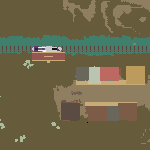

# raymapper


> *The Western template place*

An experimental Roblox minimap generator I made in a few hours. 

This works by retrieving each pixel color from raycasts, then converting it to a JSON table. Below is an example 3x2 image:
```json
[
	[[255,255,255], [255,0,0], [0,0,255]],
	[[255,255,255], [255,0,0], [0,0,255]],
]
```

This is an experimental project for learning purposes. I haven't implemented any compression/encoding, so the output files will take a lot of space and may be expensive to run this.


### To use this anyway:
1. Import raymapper.lua as a ModuleScript in workspace. Configure everything to your choice.
2. Run ``require(workspace.raymapper)()``. 
> By default, this will save the output JSON string in a StringValue. This may not work for larger files due to the character limit, so you should customize your export function (send it to a server, split and save it on multiple StringValues, etc).
To export as a .PNG:
3. Save the string in a .json file. 
4. Setup raymapper.html in an IDE (js.do, jsfiddle, etc., or use mine at https://js.do/gcaptain/raymapjson). This is the .json file parser, which renders each pixel in an HTML canvas.
5. Upload the .json file. The results should appear in the canvas. Save it as an image.
